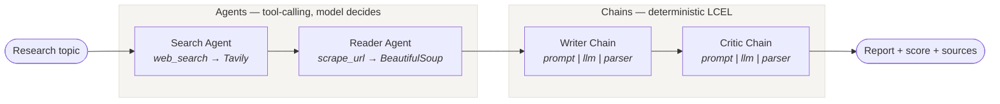

# Research Analyst

> A multi-agent research system that searches the web, reads the most relevant source, drafts a structured report, and then critiques and scores its own output — exposed through both a CLI and a Streamlit interface.


---

## Overview

Asking a language model a research question directly gives you one pass of whatever it memorised during training — no live sources, no citations, and no check on whether the answer is any good.

**Research Analyst** decomposes that single request into a four-stage pipeline where each stage has one job:

1. **Search** the live web for credible sources
2. **Read** the most relevant one in full, past the search snippet
3. **Write** a structured report grounded in what was actually retrieved
4. **Critique** that report against an explicit rubric and assign a score

The result is a report that cites real URLs retrieved at runtime, plus an independent quality assessment of that report — so the output arrives with a confidence signal attached rather than being taken on faith.

The system combines two patterns from the LangChain ecosystem. The retrieval stages are **agents** — they decide for themselves which tool to call and with what arguments. The generation stages are **deterministic LCEL chains** — no decisions to make, so no agent loop is warranted. Choosing correctly between the two is the central design decision of this project, and it is explained under [Design decisions](#design-decisions).

---

## Interface

The Streamlit UI runs the full pipeline with live stage-by-stage progress and presents the report, the critique, extracted sources, and the raw intermediate output across four tabs.

<!-- Add a screenshot at docs/screenshot.png and it will render here -->


---

## Architecture



State is carried between stages as a plain Python dictionary. Each stage reads what it needs from that dictionary and writes its own result back, which keeps the flow inspectable at every step — useful both for debugging and for explaining the system.

---

## How it works

| # | Stage | Type | Tool / Chain | Input | Output |
|---|-------|------|--------------|-------|--------|
| I | **Search Agent** | LangGraph agent | `web_search` (Tavily API) | Research topic | Titles, URLs and snippets for the top 5 results |
| II | **Reader Agent** | LangGraph agent | `scrape_url` (requests + BeautifulSoup) | First 800 chars of stage I | Up to 3,000 chars of clean page text |
| III | **Writer Chain** | LCEL chain | `prompt \| llm \| StrOutputParser` | Topic + combined research | Structured markdown report |
| IV | **Critic Chain** | LCEL chain | `prompt \| llm \| StrOutputParser` | The drafted report | Score out of 10, strengths, improvements, verdict |

**Stages I and II are agents** because the model must decide *which* tool to invoke and *what arguments* to pass — in stage II it reads the search results and picks a URL itself. That decision loop is exactly what `create_agent` provides.

**Stages III and IV are chains** because there is nothing to decide. Given the research, always draft a report. Given the report, always critique it. A fixed sequence of prompt → model → string parser is cheaper, faster and fully deterministic in its control flow.

---

## Design decisions

**Agents where decisions exist, chains everywhere else.**
An agent runs a reason–act loop and may call its tools any number of times, costing extra model round-trips. Using one where the control flow is already known is wasted latency and spend. Stages III and IV have exactly one path through them, so they are chains.

**One tool per agent.**
The search agent holds only `web_search`; the reader agent holds only `scrape_url`. Narrow tool scope removes an entire class of failure where a model picks a plausible-but-wrong tool, and it keeps each agent's prompt focused.

**A separate critic pass rather than "write a good report".**
Asking a model to self-assess inside the same generation biases it toward defending what it just wrote. Running the critique as an independent invocation, with the report supplied as input and a fixed output format demanded, produces a materially more honest assessment.

**Scraping is bounded and fails soft.**
`scrape_url` uses an 8-second timeout, strips `style`/`nav`/`footer` elements, truncates to 3,000 characters, and returns an error *string* rather than raising on failure. A dead link degrades the report; it does not crash the pipeline.

**Search results are truncated before the reader agent.**
Only the first 800 characters of stage I reach stage II. The reader only needs enough context to choose a URL, and shipping the full result set would inflate token cost for no gain.

---

## Tech stack

| Layer | Choice | Why |
|-------|--------|-----|
| Orchestration | LangChain 1.x + LangGraph | `create_agent` runs on LangGraph, giving a durable tool-calling loop without hand-writing one |
| LLM | Mistral (`mistral-medium-latest`) via `langchain-mistralai` | Strong instruction-following and native tool calling at low cost |
| Web search | Tavily (`langchain-tavily`) | Search API purpose-built for LLM consumption — returns clean snippets, not raw HTML |
| Scraping | `requests` + BeautifulSoup 4 | Fetch and strip a page to readable text |
| Composition | LCEL (`prompt \| llm \| parser`) | Declarative chaining with streaming and batching for free |
| Configuration | `python-dotenv` | API keys stay in `.env`, never in source |
| Interface | Streamlit | Full UI in pure Python, no separate frontend |
| Packaging | `uv` | Fast, reproducible environment resolution |

---

## Project structure

```
research_analyst/
├── tools.py            # Tool definitions: web_search (Tavily), scrape_url (BeautifulSoup)
├── agents.py           # LLM config, both agents, writer chain, critic chain
├── pipeline.py         # CLI orchestrator — runs all four stages in order
├── app.py              # Streamlit UI (imports agents.py; contains no pipeline logic of its own)
├── requirements.txt    # Pinned dependency ranges
├── .streamlit/
│   └── config.toml     # UI theme
├── .env                # API keys — git-ignored, never committed
└── .gitignore
```

Separation of concerns is deliberate: `tools.py` knows nothing about agents, `agents.py` knows nothing about orchestration, and `app.py` is presentation only. Any layer can be tested or swapped in isolation.

---

## Getting started

### Prerequisites

- Python 3.13
- [`uv`](https://docs.astral.sh/uv/) (or `pip`)
- A [Mistral API key](https://console.mistral.ai/)
- A [Tavily API key](https://tavily.com/) — the free tier is sufficient

### 1. Clone and create the environment

```bash
git clone https://github.com/Ramcharan-AIML/research_analyst.git
cd research_analyst

uv venv
# Windows
.venv\Scripts\activate
# macOS / Linux
source .venv/bin/activate
```

### 2. Install dependencies

```bash
uv pip install -r requirements.txt
```

The Streamlit interface additionally requires Streamlit:

```bash
uv pip install streamlit
```

> **Note:** a `uv`-created virtual environment does not ship `pip`. Use `uv pip install ...`, not `python -m pip install ...`.

### 3. Configure API keys

Create a `.env` file in the project root:

```env
MISTRAL_API_KEY=your_mistral_key_here
TAVILY_API_KEY=your_tavily_key_here
```

`.env` is listed in `.gitignore` and must never be committed.

---

## Usage

### Streamlit interface

```bash
streamlit run app.py
```

Opens at `http://localhost:8501`.

- **Sample data** is toggled on by default in the sidebar — it renders a full example result instantly with **no API calls**, so the interface can be explored at zero cost.
- Toggle it off to run the real pipeline against your keys.

Interface features:

| Feature | Description |
|---------|-------------|
| Stage tracker | Live Pending → Running → Complete status for all four stages |
| Metrics | Critic score, report length, unique sources, elapsed run time |
| Report tab | Rendered report with a document header (topic, timestamp, model, counts) |
| Critique tab | Score with progress bar, plus the full critic assessment |
| Sources tab | Every URL from the run, deduplicated and grouped by domain |
| Research trail | Raw stage I and stage II output for debugging and verification |
| Export | Download the report alone, or a bundle including critique and raw research |
| Run history | Recent topics with timestamps, kept in session state |

### Command line

```bash
python pipeline.py
```

Prompts for a topic and prints each stage's output to the terminal as it completes.

---

## Configuration

| Variable | Required | Purpose |
|----------|----------|---------|
| `MISTRAL_API_KEY` | Yes | Authenticates all four LLM stages |
| `TAVILY_API_KEY` | Yes | Authenticates the `web_search` tool |

Model behaviour is set in `agents.py`:

```python
llm = ChatMistralAI(
    model="mistral-medium-latest",
    temperature=0.1,
)
```

Low temperature is intentional — this is a factual research task, where reproducibility matters more than creative variation.

---

## Troubleshooting

<details>
<summary><b>HTTP 422 — <code>extra_forbidden</code> on a request body field</b></summary>

<br>

A misspelled constructor argument (for example `temparature`) is not recognised as a model field, so LangChain forwards it into `model_kwargs`, which is passed straight through to the provider. Mistral validates its request body strictly and rejects unknown fields with a 422.

The early warning sign appears at import time:

```
UserWarning: WARNING! temparature is not default parameter.
             temparature was transferred to model_kwargs.
```

Treat that warning as an error — check the spelling of every keyword argument passed to `ChatMistralAI`.
</details>

<details>
<summary><b>TypeError: can only concatenate list (not "str") to list</b></summary>

<br>

In LangChain 1.x, `message.content` is a union type: a plain string **or** a list of content blocks such as `[{"type": "text", "text": "..."}]`. Providers may return either. Code that assumes a string breaks when the list form arrives.

`app.py` normalises at the boundary with an `as_text()` helper that flattens strings, dicts, and block lists to a single string before anything downstream touches the value.
</details>

<details>
<summary><b><code>No module named pip</code> inside the virtual environment</b></summary>

<br>

Environments created by `uv venv` do not include `pip`. Install with `uv pip install ...` instead.
</details>

---

## Roadmap

- [ ] Scrape the top *N* sources in parallel rather than a single URL
- [ ] Feed the critique back to the writer for a revision loop, gated on the score
- [ ] Persist runs to disk so reports survive a session
- [ ] Token and cost accounting surfaced per stage in the UI
- [ ] Response caching to avoid re-querying identical topics

---

## Author

**Ramcharan Yachamaneni** — [@Ramcharan-AIML](https://github.com/Ramcharan-AIML)

Built to explore multi-agent orchestration with LangChain : where tool-calling agents genuinely earn their cost, and where a deterministic chain is the better engineering answer.
